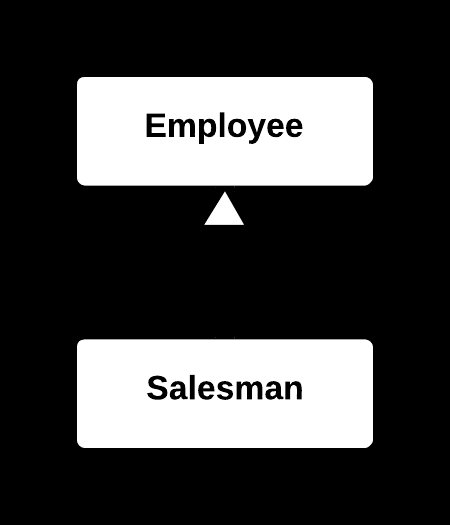

## 📉 Collapse Hierarchy Yöntemi

### 🐞 Problem

- Bir sınıf hiyerarşisi (**üst sınıf ve alt sınıflar**), artık anlamlı bir ayrım veya farklı davranış sunmuyorsa; kod gereksiz yere karmaşık hale gelir.
- Alt sınıflar, üst sınıftan yalnızca küçük farklılıklar içeriyorsa veya artık kullanılmıyorsa; hiyerarşi gereksiz detaylanmıştır.

---

### ✅ Çözüm

Hiyerarşiyi sadeleştirerek; alt sınıfları ve üst sınıfı **tek bir sınıfta birleştirin**,  
böylece gereksiz ayrımı ortadan kaldırın ve kodu sadeleştirin.

---

### 🌱 Faydaları

- Kod daha sade ve anlaşılır hale gelir.
- Gereksiz sınıf yapıları kaldırılarak bakım kolaylaşır.
- Kod tabanı küçülür, genel **karmaşıklık** azalır.

---

### 🛠️ Nasıl Uygulanır

1. Hiyerarşinin gerçekten gereksiz olduğunu ve alt sınıfların üst sınıftan anlamlı bir fark sunmadığını doğrulayın.
2. Alt sınıflardaki özellikleri ve metotları üst sınıfa taşıyın.
3. Alt sınıfları silin ve istemci kodların (client code) artık yalnızca üst sınıfı kullanmasını sağlayın.
4. Gerekirse, küçük farklılıkları yönetmek için **koşullu mantık** veya başka teknikler ekleyin.
5. Kodun doğru çalıştığından emin olmak için test edin.

## 📷 Görsel Anlatım

**Önce:**  

**Sonra:**  
