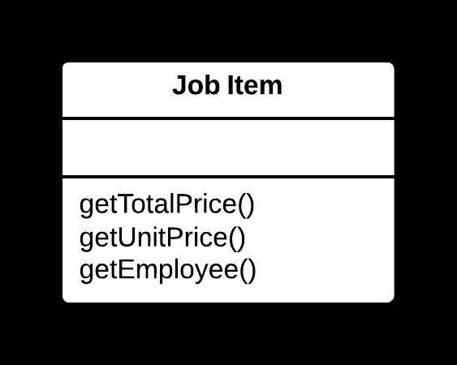
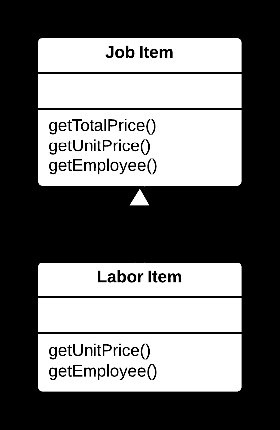

## 🧬 Extract Subclass Yöntemi

### 🐞 Problem

- Bir sınıf, yalnızca bazı durumlarda kullanılan özellikler veya davranışlar içeriyorsa; bu durum sınıfın gereksiz karmaşıklığına neden olur.
- Belirli özellikler veya metotlar, sınıfın yalnızca belirli örnekleri için geçerliyse; bu sorumluluklar ayrı bir yapıya ayrılmalıdır.

---

### ✅ Çözüm

Yalnızca belirli durumlarda kullanılan özellikleri veya davranışları,  
**yeni bir alt sınıfa** (**subclass**) taşıyarak ana sınıfı sadeleştirin ve sorumlulukları net bir şekilde ayırın.

---

### 🌱 Faydaları

- Ana sınıf daha sade ve genel bir yapıya kavuşur.
- Özellikler ve davranışlar yalnızca ilgili alt sınıfta bulunur; bu da kodun anlaşılırlığını artırır.
- Kodun yeniden kullanımı ve bakımı kolaylaşır.

---

### 🛠️ Nasıl Uygulanır

1. Yalnızca belirli durumlarda kullanılan özellikleri veya metotları belirleyin.
2. Yeni bir alt sınıf oluşturun ve ilgili özellikleri/metotları bu alt sınıfa taşıyın.
3. Ana sınıfta, bu özelliklerin kullanımını alt sınıfa yönlendirin (örn. **polimorfizm** veya koşullu mantık ile).
4. Gerekirse ana sınıfı **soyut (abstract)** hale getirin.
5. Kodun doğru çalıştığından emin olmak için test et.

## 📷 Görsel Anlatım

**Önce:**  

**Sonra:**  
