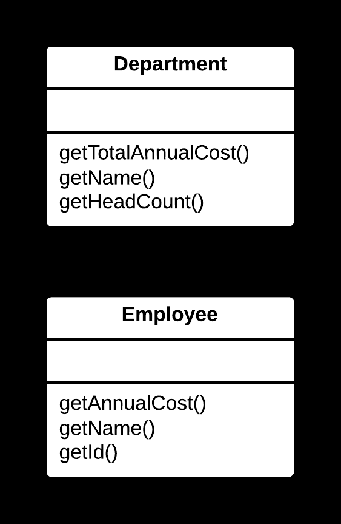
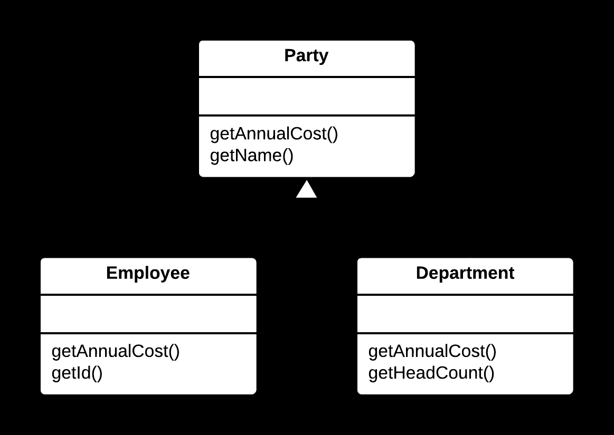

## 🏗️ Extract Superclass Yöntemi

### 🐞 Problem

- Birden fazla sınıf, ortak özellikler (**alanlar**) veya davranışlar (**metotlar**) içeriyorsa; bu durum **kod tekrarı** (**duplication**) oluşturur.
- Ortak mantığın farklı sınıflarda tekrar etmesi, bakım ve güncelleme süreçlerini zorlaştırır.

---

### ✅ Çözüm

Ortak özellikleri ve davranışları **yeni bir üst sınıfa** (**superclass**) taşıyarak kod tekrarını ortadan kaldırmak  
ve ilgili sınıfları bu üst sınıftan türetmek.

---

### 🌱 Faydaları

- Kod tekrarı azalır, bakım ve geliştirme süreçleri kolaylaşır.
- Ortak mantık üst sınıfta merkezileşir, tutarlılık artar.
- Alt sınıflar daha sade ve yalnızca kendilerine özgü sorumluluklara odaklanır.

---

### 🛠️ Nasıl Uygulanır

1. Farklı sınıflarda tekrarlayan ortak özellikleri ve davranışları tespit edin.
2. Yeni bir üst sınıf oluşturun ve bu ortak alanları/metotları üst sınıfa taşıyın.
3. Mevcut sınıfları, yeni oluşturduğunuz üst sınıftan türetin (**inherit / extend**).
4. Gerekiyorsa üst sınıfı **soyut (abstract)** hale getirin.
5. Kodun doğru çalıştığından emin olmak için test edin.

## 📷 Görsel Anlatım

**Önce:**  

**Sonra:**  
