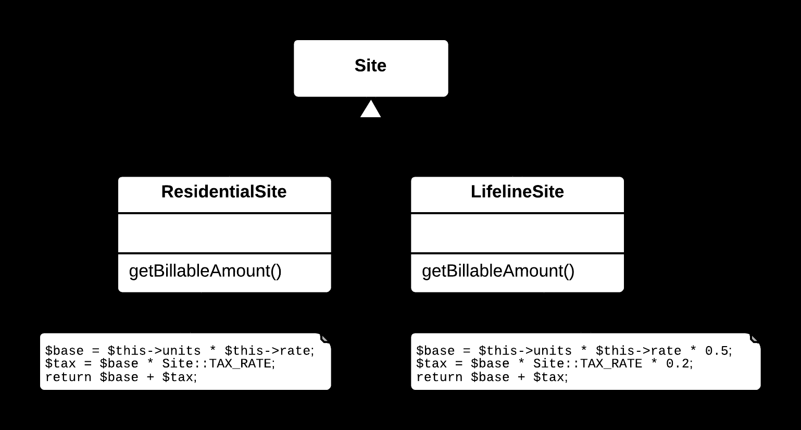
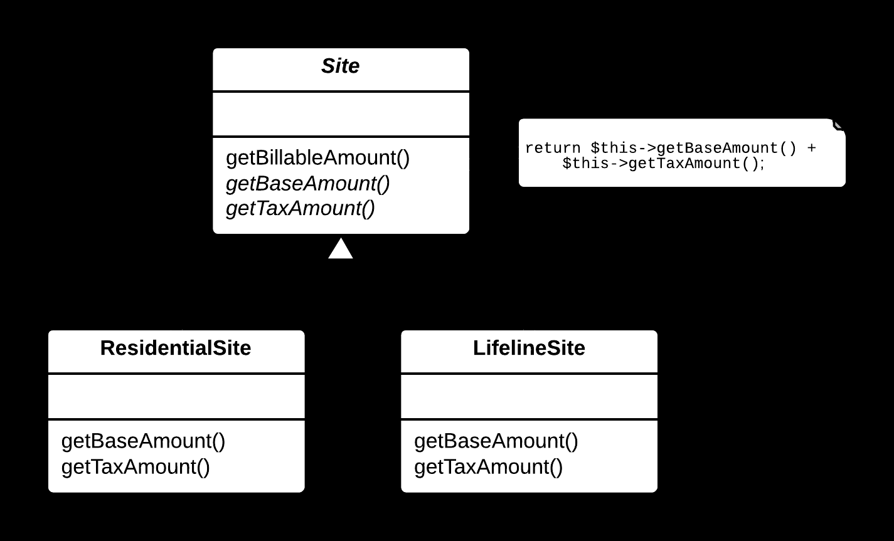

## 🧩 Form Template Method Yöntemi

### 🐞 Problem

- Birden fazla alt sınıf, benzer bir algoritmayı uyguluyor ancak bazı adımları farklı şekilde gerçekleştiriyorsa; bu durum **kod tekrarı** (**duplication**) oluşturur.
- Ortak algoritma yapısı korunurken, farklılıkların yönetimi karmaşıklaşabilir ve kodun okunabilirliği azalır.

---

### ✅ Çözüm

Ortak algoritmayı bir üst sınıf (**superclass**) metodunda **şablon (template)** olarak tanımlayın.  
Farklılık gösteren adımları ise alt sınıflarda uygulanacak **soyut (abstract)** veya **sanal (virtual)** metotlara bırakın.

---

### 🌱 Faydaları

- Kod tekrarı azalır; ortak algoritma üst sınıfta merkezileşir.
- Alt sınıflar yalnızca farklılıkları uygular; kod daha sade, anlaşılır ve bakım yapılabilir olur.
- Algoritmanın genel yapısı netleşir, okunabilirlik ve tutarlılık artar.

---

### 🛠️ Nasıl Uygulanır

1. Alt sınıflardaki ortak algoritmayı ve farklılık gösteren adımları belirleyin.
2. Üst sınıfta algoritmayı tanımlayan bir **şablon metot** (*template method*) oluşturun.
3. Farklılık gösteren adımları, üst sınıfta **soyut (abstract)** veya **sanal (virtual)** metotlar olarak tanımlayın.
4. Alt sınıflarda bu metotları kendi ihtiyaçlarına uygun şekilde uygulayın (override edin).
5. Kodun doğru çalıştığından emin olmak için test edin.

## 📷 Görsel Anlatım

**Önce:**  

**Sonra:**  
