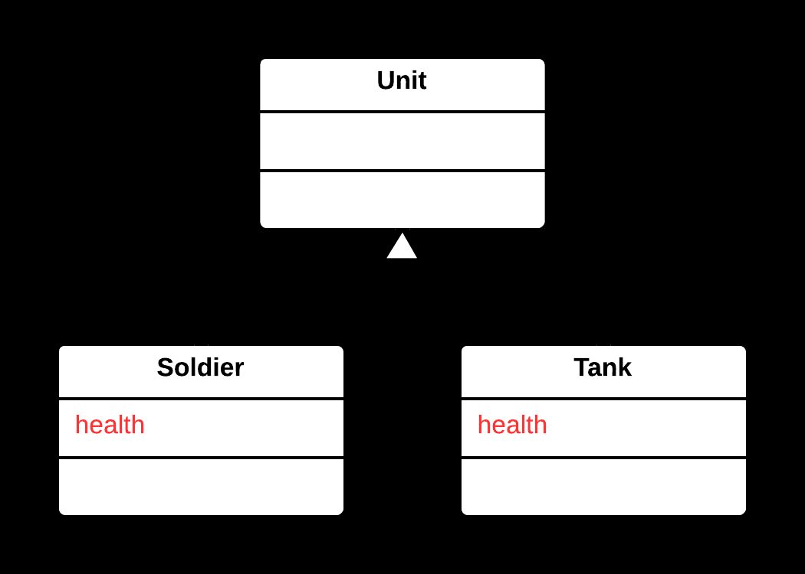
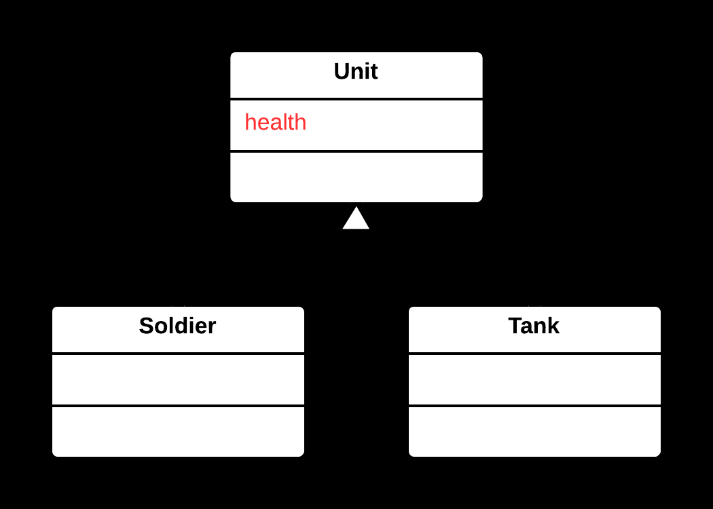

## ⬆️ Pull Up Field Yöntemi

### 🐞 Problem

- Birden fazla alt sınıf (**subclass**), aynı alanda (**field**) veya aynı türde veri kullanıyorsa; bu alanlar her alt sınıfta tekrar eder ve kod tekrarı (**duplication**) oluşur.
- Aynı alanın farklı alt sınıflarda tanımlanması, bakım ve tutarlılık sorunlarına yol açar.

---

### ✅ Çözüm

Ortak kullanılan alanı alt sınıflardan **üst sınıfa** (**superclass**) taşıyarak, kod tekrarını ortadan kaldırmak ve alanın tek bir yerde tanımlanmasını sağlamak.

---

### 🌱 Faydaları

- Kod tekrarı azalır, bakım kolaylaşır.
- Ortak veri üst sınıfta merkezileşir, tutarlılık artar.
- Alt sınıflar daha sade ve odaklanmış hale gelir.

---

### 🛠️ Nasıl Uygulanır

1. Alt sınıflarda ortak kullanılan alanı belirleyin.
2. Alanın tanımının (adı, türü, erişim seviyesi) tüm alt sınıflarda aynı olduğundan emin olun.
3. Alanı üst sınıfa taşıyın ve alt sınıflardan kaldırın.
4. Gerekirse alanın erişim seviyesini (örn. `protected`) ayarlayın.
5. Kodun doğru çalıştığından emin olmak için test et.

---

### 📷 Görsel Anlatım

**Önce:**  

**Sonra:**  

