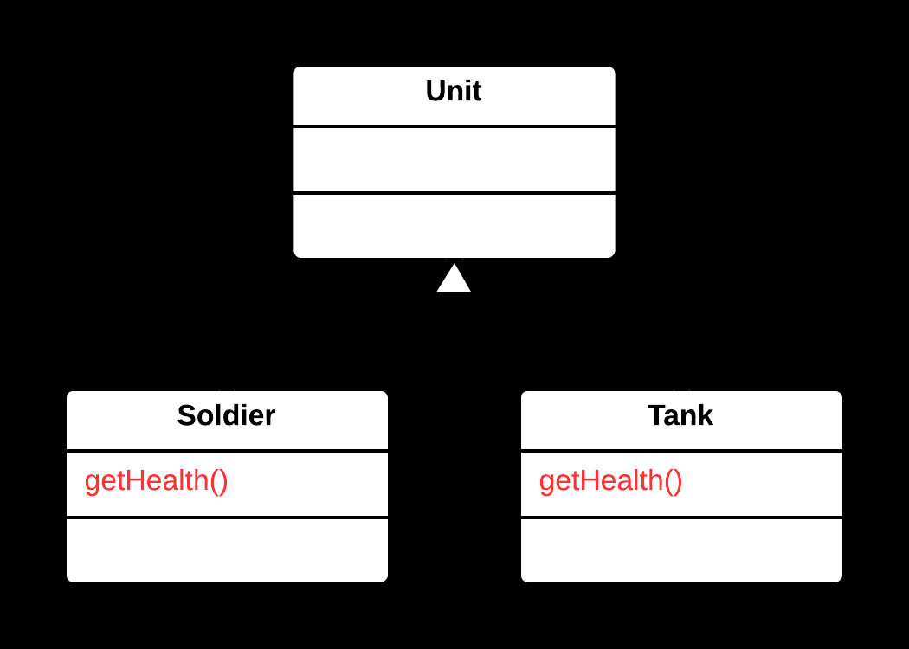
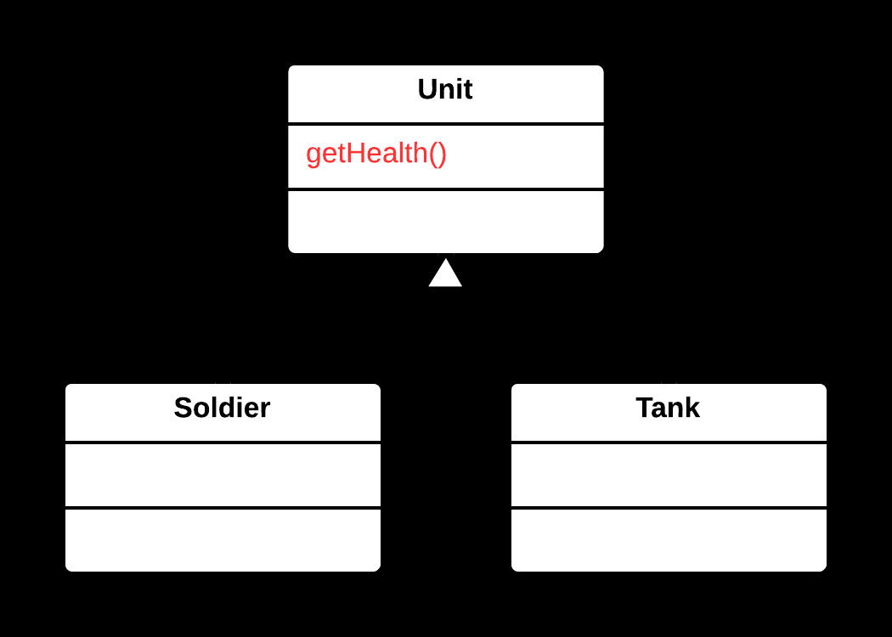

## ⬆️ Pull Up Method Yöntemi

- Birden fazla alt sınıf (**subclass**), aynı veya çok benzer bir metodu içeriyorsa, bu kod tekrarı (**duplication**) oluşturur.
- Aynı mantığın farklı sınıflarda tekrar etmesi, bakım ve güncelleme süreçlerini zorlaştırır.

---

### ✅ Çözüm

Ortak metodu alt sınıflardan **üst sınıfa** (**superclass**) taşıyarak, kod tekrarını ortadan kaldırmak ve metodu tek bir yerde tanımlamak.

---

### 🌱 Faydaları

- Kod tekrarı azalır, bakım kolaylaşır.
- Ortak davranış üst sınıfta merkezileşir, tutarlılık artar.
- Alt sınıflar daha sade ve odaklanmış hale gelir.

---

### 🛠️ Nasıl Uygulanır

1. Alt sınıflarda ortak olan metodu belirleyin.
2. Metodun imzasının (adı, parametreler, dönüş türü) ve içeriğinin tüm alt sınıflarda aynı olduğundan emin olun.
3. Metodu üst sınıfa taşıyın ve alt sınıflardan kaldırın.
4. Gerekirse metodun erişim seviyesini (örn. `protected`) ayarlayın.
5. Kodun doğru çalıştığından emin olmak için test et.

### 🐞 Problem

 