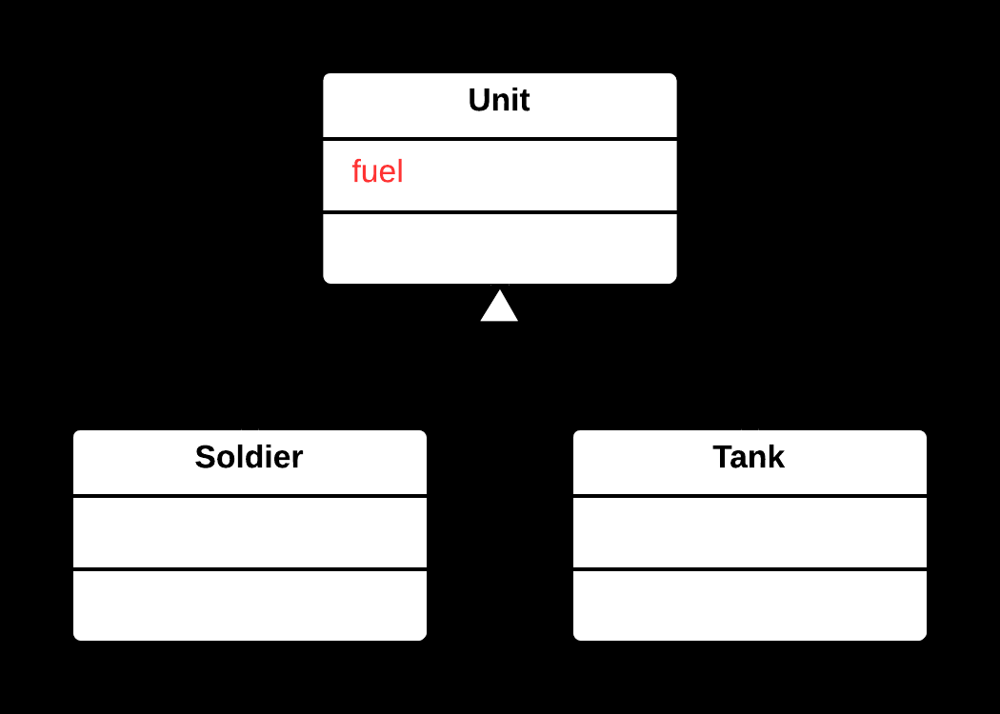
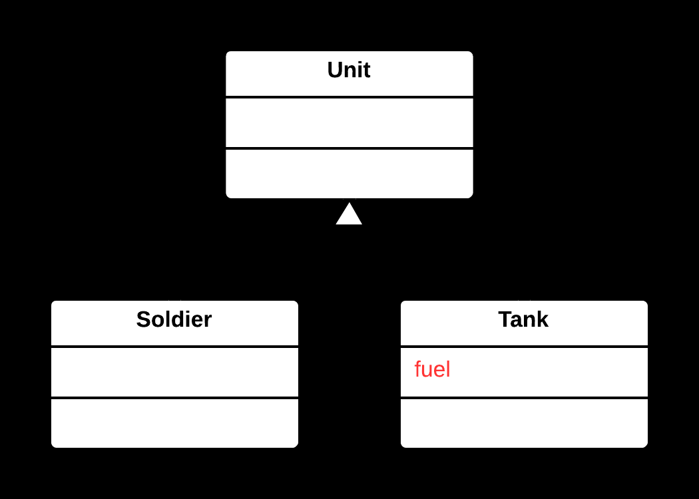

## ⬇️ Push Down Field Yöntemi

### 🐞 Problem

- Üst sınıfta (**superclass**) tanımlı bir alan (**field**), yalnızca bazı alt sınıflar (**subclass**) tarafından kullanılıyorsa;
  bu alan üst sınıfta gereksiz yere yer kaplar ve yanıltıcı olabilir.
- Üst sınıfın genel yapısı, yalnızca belirli alt sınıflara özgü verilerle karmaşıklaşır.

---

### ✅ Çözüm

Söz konusu alanı, yalnızca onu kullanan alt sınıflara taşıyarak üst sınıfı sadeleştirmek  
ve alanı ilgili alt sınıflarda tanımlamak.

---

### 🌱 Faydaları

- Üst sınıf daha sade ve genel bir yapıya kavuşur.
- Alanlar yalnızca ilgili alt sınıflarda bulunur; bu da kodun okunabilirliğini ve anlaşılırlığını artırır.
- Sorumluluklar daha iyi dağıtılır, bakım ve geliştirme süreçleri kolaylaşır.

---

### 🛠️ Nasıl Uygulanır

1. Alanın yalnızca belirli alt sınıflar tarafından kullanıldığını doğrulayın.
2. Alanı, onu kullanan alt sınıflara kopyalayın.
3. Üst sınıftan alanı kaldırın.
4. Gerekirse alt sınıflardaki alanları ihtiyaca göre özelleştirin.
5. Kodun doğru çalıştığından emin olmak için test et.

## 📷 Görsel Anlatım

**Önce:**  

**Sonra:**  
