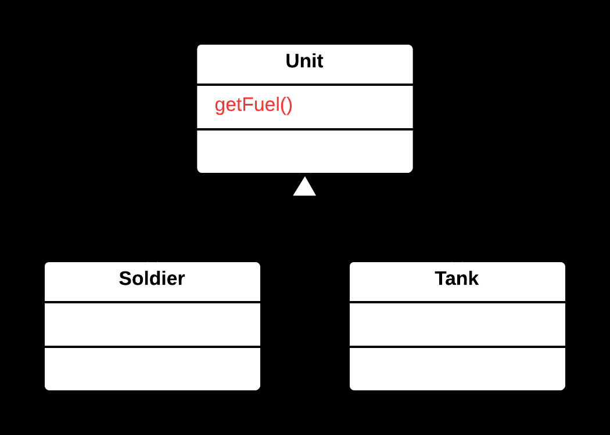
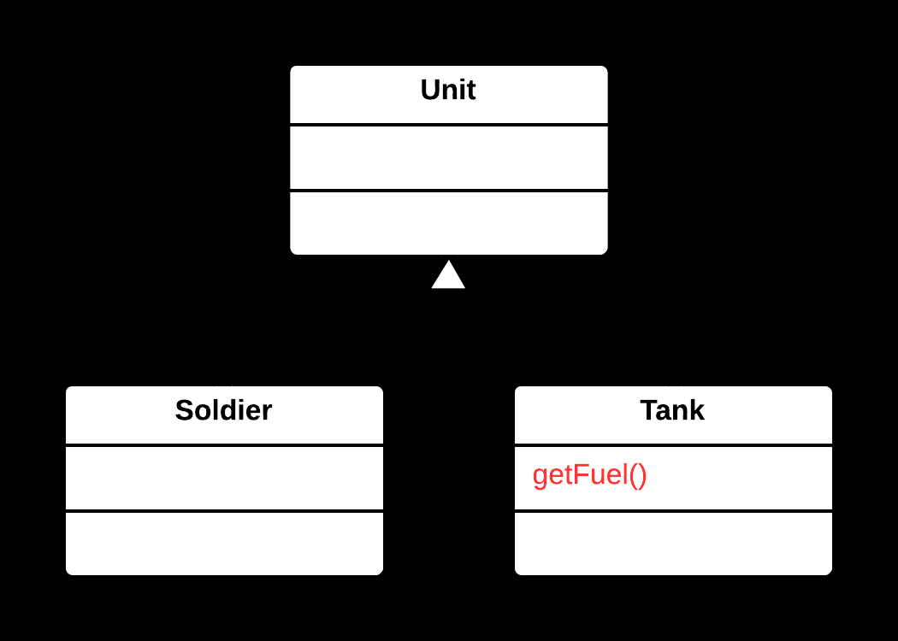

## ⬇️ Push Down Method Yöntemi

### 🐞 Problem

- Üst sınıfta (**superclass**) tanımlı bir metot, yalnızca bazı alt sınıflar (**subclass**) tarafından kullanılıyorsa;
  bu metot üst sınıfta gereksiz yere yer kaplar ve yanıltıcı olabilir.
- Üst sınıfın genel kapsamı, yalnızca belirli alt sınıflara özgü davranışlarla karmaşıklaşır.

---

### ✅ Çözüm

Söz konusu metodu, yalnızca onu kullanan alt sınıflara taşıyarak üst sınıfı sadeleştirmek  
ve metodu ilgili alt sınıflarda tanımlamak.

---

### 🌱 Faydaları

- Üst sınıf daha sade ve genel bir yapıya kavuşur.
- Metotlar, yalnızca ilgili alt sınıflarda bulunur; bu da kodun anlaşılırlığını artırır.
- Sorumluluklar daha iyi dağıtılır, **SOLID prensiplerine** uyum artar.

---

### 🛠️ Nasıl Uygulanır

1. Metodun yalnızca belirli alt sınıflar tarafından kullanıldığını doğrulayın.
2. Metodu, onu kullanan alt sınıflara kopyalayın.
3. Üst sınıftan metodu kaldırın.
4. Gerekirse alt sınıflardaki metotları özelleştirin.
5. Kodun doğru çalıştığından emin olmak için test et.

### 📷 Görsel Anlatım

**Önce:**  

**Sonra:**  

