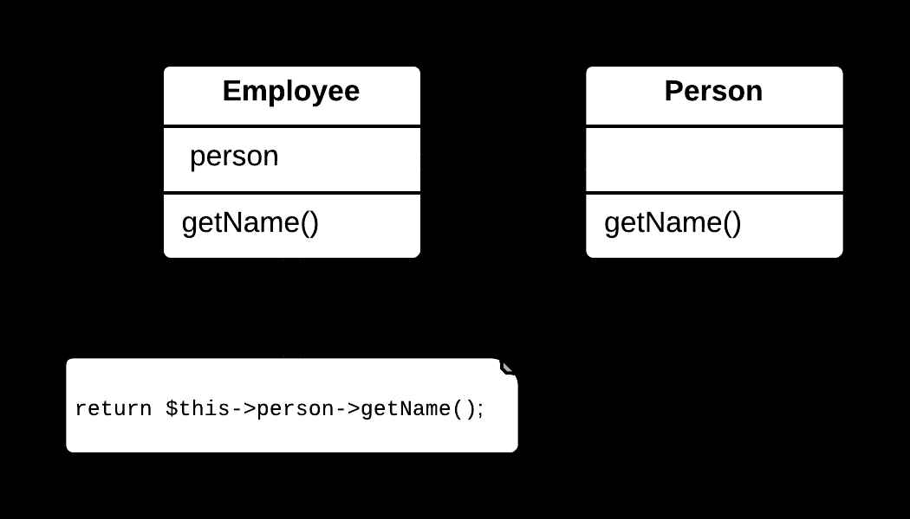
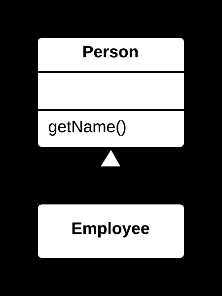

## 🔁 Replace Delegation with Inheritance Yöntemi

### 🐞 Problem

- Bir sınıf, başka bir nesneye **delegasyon** yoluyla işlevsellik kullanıyor ve bu nesnenin **çoğu veya tüm metotlarını** çağırıyorsa; bu durum gereksiz karmaşıklık yaratır.
- Delegasyon, aslında **kalıtım (inheritance)** ile daha doğal ve sade şekilde ifade edilebilecek bir ilişkiyi zorlaştırabilir.

---

### ✅ Çözüm

Delegasyon kullanılan nesneyi kaldırın; sınıfı doğrudan ilgili sınıftan **türetin** (*extend edin*)  
ve gerekli işlevselliği kalıtım yoluyla devralın.

---

### 🌱 Faydaları

- Kod daha **sade**, doğrudan ve okunabilir hale gelir.
- Gereksiz delegasyon metotları kaldırılır; bakım ve geliştirme süreçleri kolaylaşır.
- Uygun durumlarda, kalıtım daha **doğal bir sınıf ilişkisi** sağlar.

---

### 🛠️ Nasıl Uygulanır

1. Delegasyon kullanılan nesnenin ve metotlarının sınıf tarafından nasıl ve ne kadar kapsamlı kullanıldığını analiz edin.
2. Delegasyon nesnesini kaldırın.
3. Sınıfı, delegasyon nesnesinin ait olduğu sınıftan **türetin** (örn. `extends`).
4. Delegasyon metotlarını kaldırın; üst sınıfın metotlarını doğrudan kullanmaya başlayın.
5. Gerekirse **erişim seviyelerini** (örn. `protected`) düzenleyin.
6. Kodun doğru çalıştığından emin olmak için test edin.

## 📷 Görsel Anlatım

**Önce:**  

**Sonra:**  
