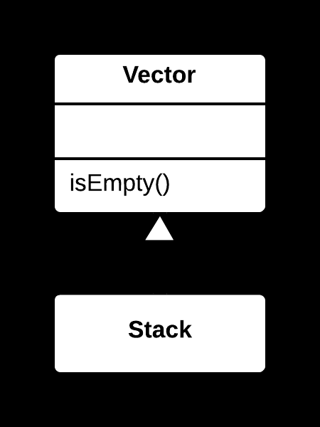
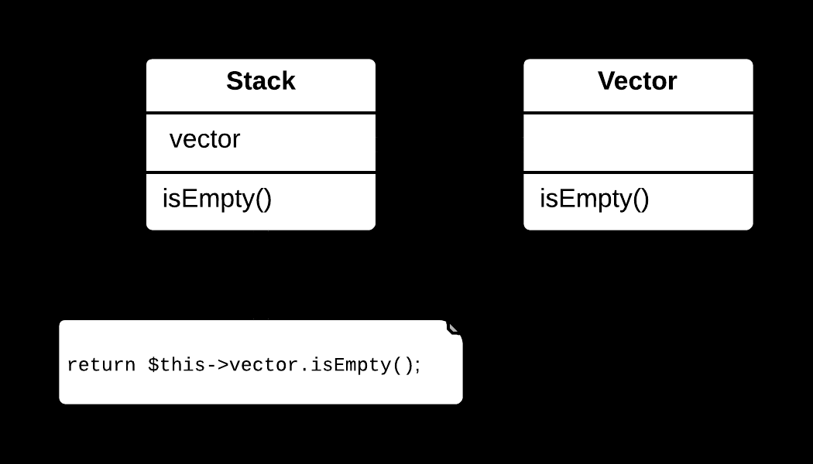

## 🔄 Replace Inheritance with Delegation Yöntemi

### 🐞 Problem

- Bir sınıf, yalnızca üst sınıfın (**superclass**) birkaç metodunu veya özelliğini kullanıyorsa; kalıtım (**inheritance**) gereksiz bir bağımlılık oluşturur.
- Kalıtım, sınıflar arasında **sıkı bir bağ** (**tight coupling**) meydana getirir ve sistemin esnekliğini azaltabilir.

---

### ✅ Çözüm

Kalıtımı kaldırın; bunun yerine, üst sınıfın işlevselliğini bir **nesne olarak** tutun  
ve bu nesneye **delegasyon (delegation)** yoluyla erişin.  
Böylece ilgili sınıf, üst sınıftan türemek yerine bu nesneyi kullanır.

---

### 🌱 Faydaları

- Sınıflar arasındaki bağımlılık azalır, sistem daha **esnek** hale gelir.
- Kod daha **modüler** ve test edilebilir olur.
- Gereksiz kalıtım ilişkileri kaldırılarak **SOLID prensipleri** (özellikle *composition over inheritance*) desteklenir.

---

### 🛠️ Nasıl Uygulanır

1. Kalıtımla kullanılan üst sınıfın **hangi metotlarının** gerçekten gerektiğini belirleyin.
2. Alt sınıfta, üst sınıfın bir **örneğini (instance)** alan (field) olarak tanımlayın.
3. Alt sınıfta, üst sınıfın ilgili metotlarını çağıran **delegasyon metotları** oluşturun.
4. Kalıtımı kaldırın (örn. `extends` ifadesini silin).
5. Kodun doğru çalıştığından emin olmak için test edin.

## 📷 Görsel Anlatım

**Önce:**  

**Sonra:**  
