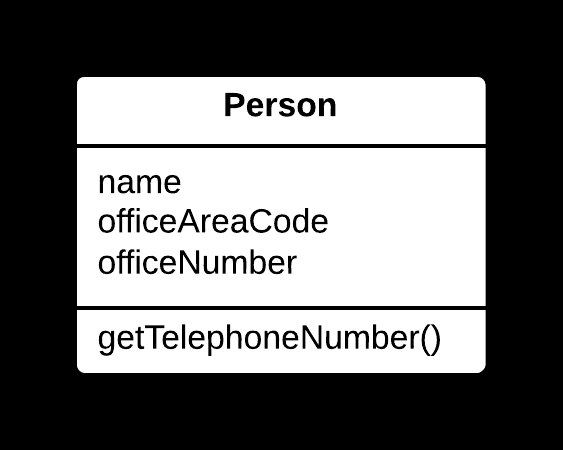
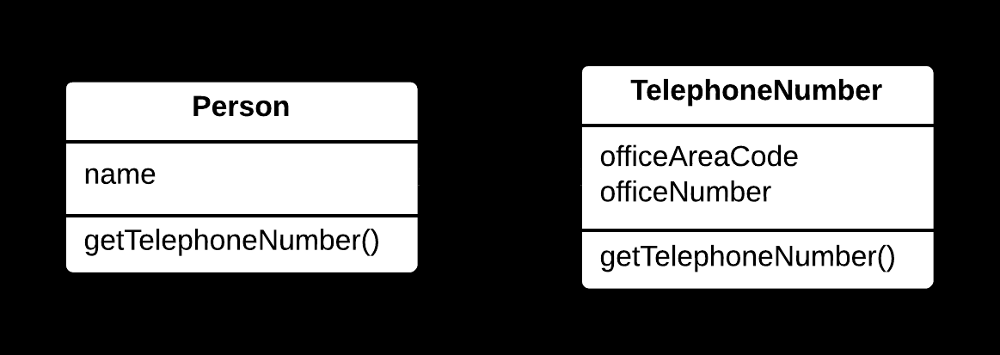

## 🧩 Extract Class Yöntemi

### 🐞 Problem

- Bir sınıf, birden fazla **sorumluluğu** üstleniyorsa (örneğin, hem veri tutma hem de iş mantığını işleme), bu durum sınıfı karmaşık ve bakımı zor hale getirir.
- Çok sayıda alan ve metot içeren bir sınıf, **Single Responsibility Principle** (*Tek Sorumluluk İlkesi*)'ne aykırıdır.

---

### ✅ Çözüm

Sınıfın belirli bir sorumluluğunu (ilgili **alanlar** ve **metotlar**)  
yeni bir sınıfa taşıyarak mevcut sınıfı **sadeleştirin**  
ve her sınıfın tek bir sorumluluğu olmasını sağlayın.

---

### 🌱 Faydaları

- Sınıflar daha **odaklanmış** ve anlaşılır hale gelir.
- Kodun **bakımı** ve **test edilmesi** kolaylaşır.
- Kod tekrarı azalır, **yeniden kullanılabilirlik** artar.

---

### 🛠️ Nasıl Uygulanır

1. Sınıfın hangi **sorumluluğunun** ayrılacağını ve mantıklı şekilde gruplanabileceğini belirleyin.
2. Yeni bir sınıf oluşturun; ilgili **alanları** ve **metotları** bu sınıfa taşıyın.
3. Mevcut sınıfta, yeni sınıfın bir **örneğini (instance)** tutun ve ilgili işlemleri bu örneğe yönlendirin.
4. Gerekirse iki sınıf arasındaki ilişkiyi (örn. **delegasyon**) düzenleyin.
5. Kodun doğru çalıştığından emin olmak için **test edin**.

# 📷 Görsel Anlatım

**Önce:**  

**Sonra:**  
