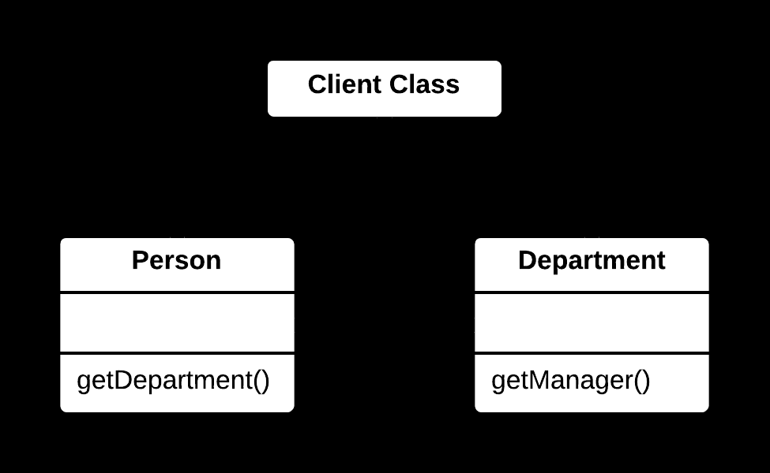
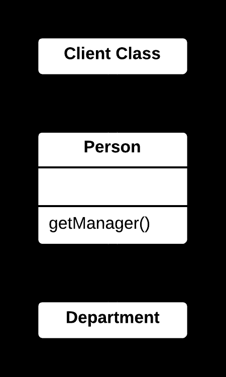

## 🛡️ Hide Delegate Yöntemi

### 🐞 Problem

- Bir **istemci (client)**, bir nesnenin iç yapısına (örneğin başka bir nesneye) doğrudan erişip onun metotlarını çağırıyorsa, bu durum **sıkı bir bağımlılık (tight coupling)** oluşturur.
- Nesnenin iç yapısındaki değişiklikler, istemcileri doğrudan etkiler ve bakım süreci zorlaşır.

---

### ✅ Çözüm

Delegasyon nesnesine doğrudan erişimi kaldırın.  
Ana sınıf üzerinden **wrapper metotlar (arayüz)** sağlayarak,  
istemcilerin yalnızca ana sınıfla iletişim kurmasını sağlayın.

---

### 🌱 Faydaları

- Nesneler arasındaki **bağımlılık azalır**, **enkapsülasyon (encapsulation)** artar.
- Ana sınıf, iç yapısını **gizler**; bu da değişikliklerin daha kolay ve güvenli yapılmasını sağlar.
- Kod daha **sade**, **okunabilir** ve **bakımı kolay** hale gelir.

---

### 🛠️ Nasıl Uygulanır

1. İstemcinin doğrudan eriştiği delegasyon nesnesini ve kullandığı metotları belirleyin.
2. Ana sınıfta, delegasyon nesnesinin metotlarını çağıran **wrapper metotlar** oluşturun.
3. İstemcileri, doğrudan delegasyon nesnesi yerine ana sınıfın wrapper metotlarını kullanacak şekilde güncelleyin.
4. Gerekirse delegasyon nesnesine erişimi **kısıtlayın** (örn. `private` yaparak).
5. Kodun doğru çalıştığından emin olmak için **test edin**.

# 📷 Görsel Anlatım

**Önce:**  

**Sonra:**  
