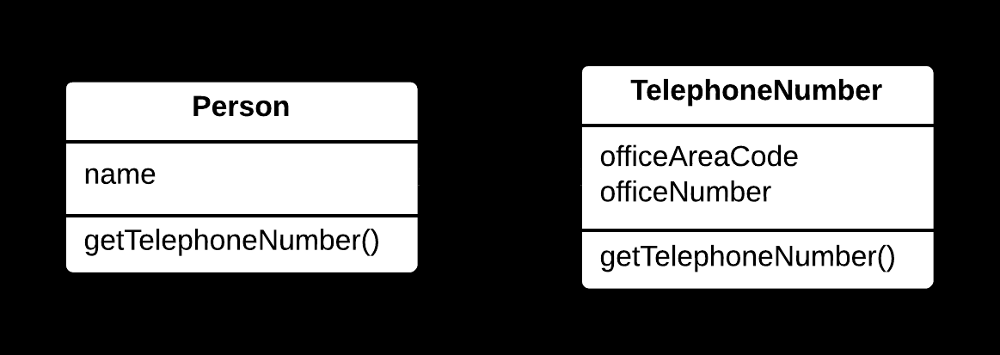
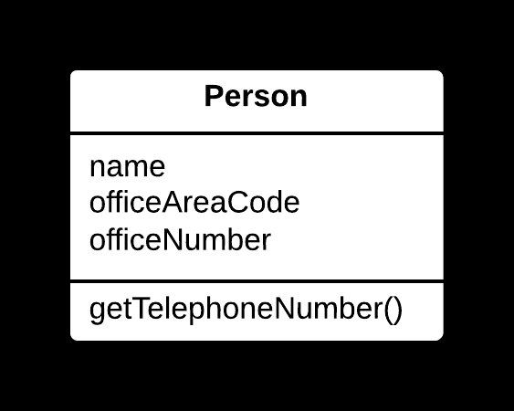

## 📉 Inline Class Yöntemi

### 🐞 Problem

- Bir sınıf, yalnızca **sınırlı bir sorumluluğa** sahipse veya artık anlamlı bir işlevi yoksa,  
  ayrı bir sınıf olarak var olması **gereksiz karmaşıklık** yaratır.
- Sınıfın içeriği, başka bir sınıfa entegre edildiğinde daha **sade** ve anlaşılır bir yapı elde edilebilir.

---

### ✅ Çözüm

Sınıfın **alanlarını** ve **metotlarını**, onu kullanan ana sınıfa taşıyın ve  
orijinal sınıfı kaldırarak kodu sadeleştirin.

---

### 🌱 Faydaları

- Kod tabanı daha **basit** ve **az sınıflı** hale gelir.
- Gereksiz sınıf yapıları kaldırılarak **bakım kolaylaşır**.
- Kodun **okunabilirliği** artar.

---

### 🛠️ Nasıl Uygulanır

1. Inline edilecek sınıfın yalnızca bir veya birkaç yerde kullanıldığını doğrulayın.
2. Sınıfın **alanlarını** ve **metotlarını** ana sınıfa taşıyın.
3. Ana sınıfta, taşınan öğeleri uygun şekilde entegre edin (örn. **isim çakışmalarını** çözün).
4. Orijinal sınıfı kaldırın ve tüm referansları **ana sınıfa yönlendirin**.
5. Kodun doğru çalıştığından emin olmak için **test edin**.

# 📷 Görsel Anlatım

**Önce:**  

**Sonra:**  
