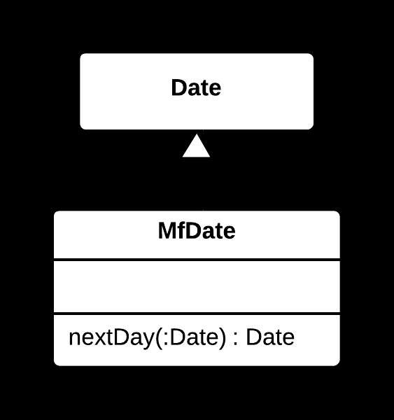

## ✨ Introduce Local Extension Yöntemi

### 🐞 Problem

- Bir sınıf (genellikle üçüncü taraf veya değiştirilemeyen bir sınıf) ihtiyaç duyulan ek işlevselliği sağlamıyorsa, bu sınıfı doğrudan değiştirmek mümkün olmayabilir.
- Yeni işlevsellik eklemek için mevcut sınıfı genişletmek veya sarmalamak gerekir, ancak bu işlem istemci kodunda dağınıklığa neden olabilir.

---

### ✅ Çözüm

- Mevcut sınıfı genişleten (**extend**) bir alt sınıf veya bir **sarmalayıcı** (**wrapper**) sınıf oluşturun.
- Ek işlevselliği bu yeni sınıfta tanımlayın.
- İstemciler, orijinal sınıf yerine bu yeni sınıfı kullanır.

---

### 🌱 Faydaları

- Orijinal sınıfı değiştirmeden ek işlevsellik eklenebilir.
- Kod daha modüler ve yeniden kullanılabilir olur.
- İstemci kod, yeni işlevselliği kolayca kullanabilir.

---

### 🛠️ Nasıl Uygulanır

1. Değiştirilemeyen sınıfta ihtiyaç duyulan ek işlevselliği belirleyin.
2. Orijinal sınıfı genişleten bir alt sınıf veya onu sarmalayan bir sınıf oluşturun.
3. Yeni sınıfta gerekli metotları ekleyin.
4. İstemci kodda, orijinal sınıf yerine yeni sınıfı kullanın.
5. Kodu test ederek doğruluğunu kontrol edin.

# 📷 Görsel Anlatım

**Önce:**  

**Sonra:**  
