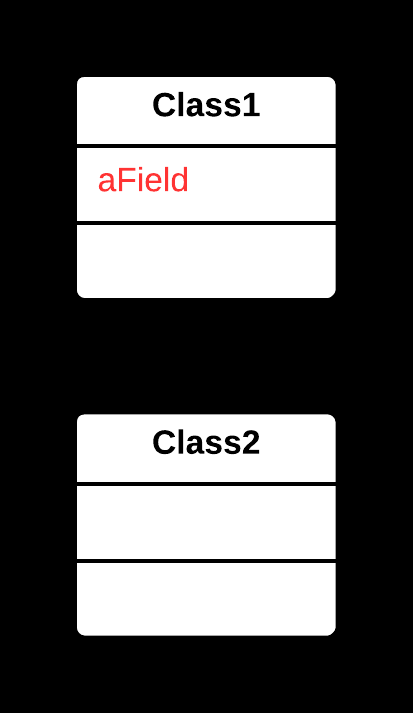
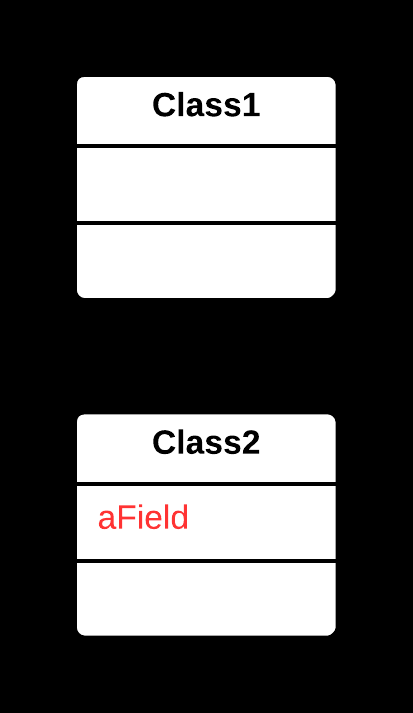

## 📦 Move Field Yöntemi

### 🐞 Problem

- Bir alan (**field**), ait olduğu sınıftan çok başka bir sınıfta daha fazla kullanılıyorsa  
  veya başka bir sınıfın verileriyle daha sıkı ilişkili hale geldiyse; bu alan yanlış yerde tanımlanmıştır.
- Alan, mevcut sınıfın bağlamından ziyade başka bir sınıfın **sorumluluklarıyla** daha uyumludur.

---

### ✅ Çözüm

Alanı, daha uygun olan **hedef sınıfa** taşıyın.  
Gerekirse orijinal sınıftan bu alana erişimi yönlendirin.

---

### 🌱 Faydaları

- Kod daha mantıklı bir şekilde organize olur; **sınıfların sorumlulukları netleşir**.
- Alan, ilgili metotlara ve verilere **daha yakın** hale gelir; bağımlılıklar azalır.
- Kodun okunabilirliği ve bakımı **kolaylaşır**.

---

### 🛠️ Nasıl Uygulanır

1. Alanın hangi sınıfta daha uygun olduğunu belirleyin (genellikle **kullanım sıklığı** veya **veri bağımlılıkları** incelenir).
2. Alanı hedef sınıfa taşıyın ve gerekirse **erişim seviyesini** (`private`, `protected` vb.) ayarlayın.
3. Orijinal sınıfta, alana erişimi hedef sınıf üzerinden yönlendirin (örn. **getter/setter** metoduyla).
4. Gerekirse hedef sınıfa bir **referans** ekleyin.
5. Kodun doğru çalıştığından emin olmak için **test edin**.

# 📷 Görsel Anlatım

**Önce:**  

**Sonra:**  
