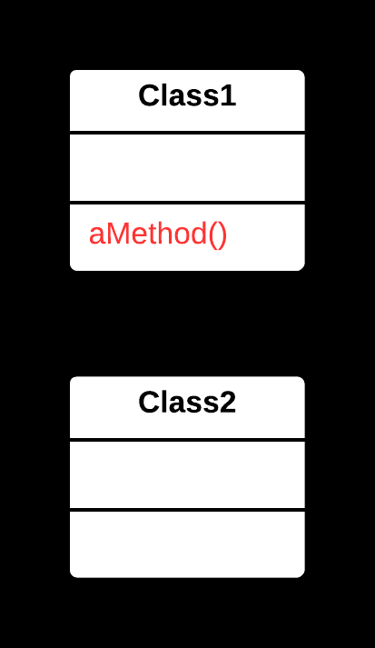
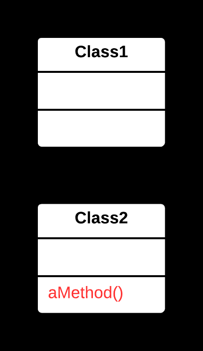

## ✏️ Move Method Yöntemi

### 🐞 Problem

- Bir metot, ait olduğu sınıftan çok başka bir sınıfta daha fazla kullanılıyorsa veya başka bir sınıfın verilerine daha **bağımlı** hale geldiyse; bu metot yanlış yerde tanımlanmıştır.
- Metot, mevcut sınıfın bağlamından ziyade başka bir sınıfın **sorumluluklarıyla** daha uyumludur.

---

### ✅ Çözüm

Metodu, daha uygun olan **hedef sınıfa** taşıyın.  
Gerekirse, orijinal sınıftan bu metodu çağırın veya tamamen kaldırın.

---

### 🌱 Faydaları

- Kod daha mantıklı bir şekilde organize olur; **sınıfların sorumlulukları netleşir**.
- Metot, ilgili **verilere daha yakın** olur; bağımlılıklar azalır.
- Kodun okunabilirliği ve bakımı **kolaylaşır**.

---

### 🛠️ Nasıl Uygulanır

1. Metodun hangi sınıfta daha uygun olduğunu belirleyin (genellikle veri bağımlılıklarına bakarak).
2. Metodu hedef sınıfa kopyalayın ve gerekirse **parametrelerini** veya **erişim seviyesini** ayarlayın.
3. Orijinal sınıfta metodu kaldırın veya hedef sınıfın metodunu çağıracak şekilde güncelleyin.
4. Gerekirse hedef sınıfa erişim için bir **referans** ekleyin.
5. Kodun doğru çalıştığından emin olmak için test edin.

# 📷 Görsel Anlatım

**Önce:**  

**Sonra:**  
