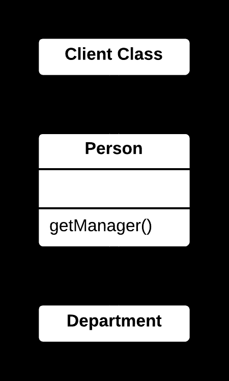
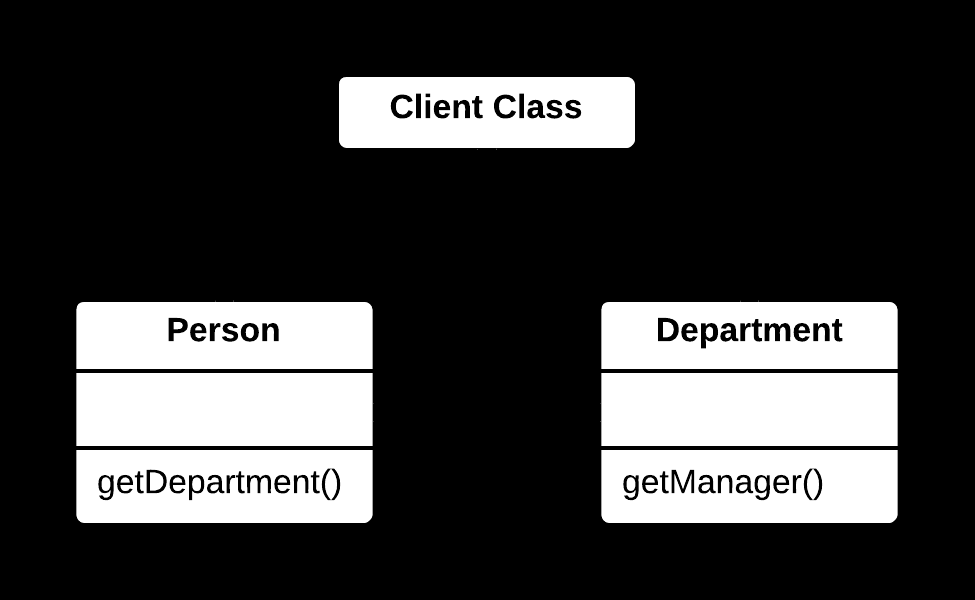

## 🔄 Remove Middle Man Yöntemi

### 🐞 Problem

- Bir sınıf, yalnızca başka bir nesnenin metotlarını yönlendiren (delegating) bir aracı (middle man) gibi davranıyorsa, bu durum gereksiz karmaşıklık yaratır.  
- İstemciler, doğrudan hedef nesneyle iletişim kurabilecekken aracı sınıf üzerinden iletişim kuruyorsa, kod fazla dolaylı hale gelir.

---

### ✅ Çözüm

- Aracı sınıfın yönlendirme metotlarını kaldırın.  
- İstemcilerin doğrudan hedef nesneyle iletişim kurmasını sağlayarak aracı sınıfı bypass edin.

---

### 🌱 Faydaları

- Kod daha doğrudan ve sade olur.  
- Gereksiz yönlendirme katmanı kaldırılarak performans ve okunabilirlik artar.  
- İstemciler, ihtiyaç duydukları nesneye doğrudan erişir.

---

### 🛠️ Nasıl Uygulanır

1. Aracı sınıfın yalnızca yönlendirme yapan metotlarını belirleyin.  
2. İstemcileri, aracı sınıf yerine hedef nesnenin metotlarını doğrudan çağıracak şekilde güncelleyin.  
3. Aracı sınıfın yönlendirme metotlarını kaldırın.  
4. Eğer aracı sınıfın başka bir işlevi yoksa, sınıfı tamamen kaldırın.  
5. Kodu test ederek doğruluğunu teyit edin.

# 📷 Görsel Anlatım

**Önce:**  

**Sonra:**   
